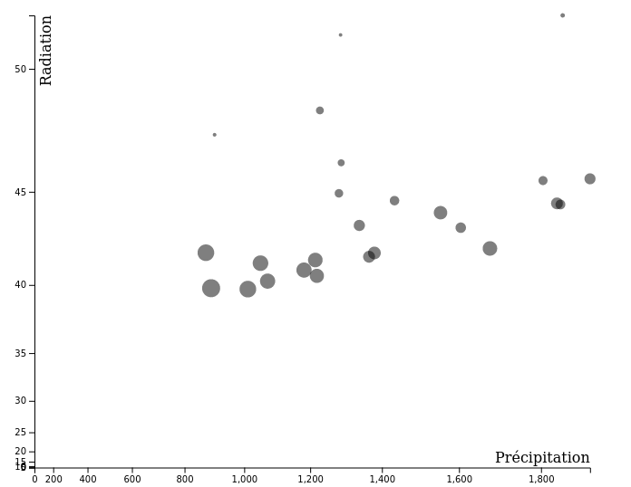

# Examen Visualdon - 28 juin 2022

Le travail sera rendu au plus tard à 16h15, par e-mail (noemi.romano@heig-vd.ch). 

Vous rendrez un fichier ZIP de tout votre projet excepté le dossier "node_modules" et vous donnerez votre nom de famille, prénom et classe à ce dossier. Vous êtes responsable de son contenu et devez vous assurer de la bonne réception du dossier avant de quitter la salle.
## Installation
* Clonez la [repository](https://github.com/romanoe/examen-visualdon-22/) `git clone https://github.com/romanoe/examen-visualdon-22.git` ou téléchargez et décompressez le dossier depuis [Cyberlearn](https://cyberlearn.hes-so.ch/course/view.php?id=21037#section-9).
* Rentrez dans le dossier *examen-visualdon-22* :  ``cd examen-visualdon-22``
* Installez les packages nécessaires : ```npm install```
* Démarrez le serveur : ```npm start```

:rocket: Vous devriez avoir accès à votre serveur local sur [localhost:8080](http:localhost:8080) :rocket:

## Exercice 1 - SVG (15 points)
Reproduire le dessin suivant dans le navigateur à l’aide des outils que vous avez appris en cours.

> :exclamation: La grille est à titre indicatif et elle ne doit pas être dessinée. 


## Exercice 2 - Précipitation et ensoleillement en Suisse (20 points) :sunny: :rainbow:
Vous avez à disposition les données de [MétéoSuisse](https://www.meteosuisse.admin.ch/home/climat/le-climat-suisse-en-detail/raeumliche-klimaanalysen.html)
de précipitation et d'ensoleillement par canton (`data/canton_data.geojson`). 

S'agissant d'un fichier `geojson`, la composante géographique est directement dans les données. Les données sont structurées de la manière suivante :

* `id` : identifiant canton
* `name`: nom du canton (p. ex. _Vaud_)
* `precipitation`: précipitation moyenne annuelle  
* `radiation` : ensoleillement moyen annuel
* `latitude` : coordonnée sud (_à utiliser dans exercice 3.2_)
* `longitude`: coordonnée est 

Apportez les manipulations suivantes et imprimez les résultats dans la console :

1. Le **nom du canton** avec le plus d'ensoleillement (maximum `radiation`) :dart: **5 points** :dart:
2. Le **nom du canton** avec le moins de précipitations (minimum `precipitation`) :dart: **5 points** :dart:
3. La moyenne de précipitation en Suisse :dart: **10 points** :dart:

## Exercice 3 - Visualisations (45 points)
Avec les donnés de l'exercice précédent, produisez les visualisations suivantes :

### 3.1 Carte
* Visualisez une carte choroplète des cantons selon les valeurs de précipitations (sélecteur SVG et projection déjà en place :gift:) :dart: **10 points** :dart:
* Rajoutez une info-bulle avec la précipitation par canton quand vous y survolez avec la souris :dart: **10 points** :dart:
          
### 3.2 Bubble chart
* Visualisez la relation entre ensoleillement et précipitation à l'aide d'un bubble chart (sélecteur SVG déjà en place) :dart: **10 points** :dart:
  * Radiation en axe Y
  * Précipitation en axe X
  * Les rayons des cercles proportionnels à la `latitude`



* Créez une animation d'entrée pour les cercles (r=0 à r=`latitude`)  :dart: **10 points** :dart:
* Quel est le type d'échelle le plus pertinent à utiliser pour la `precipitation` ? Imprimez la réponse dans la console. :dart: **5 points** :dart:

 ## Exercice 4 - Web scraping (20 points)
* Rentrez dans le dossier web-scraping `cd web-scraping`
* Installez les packages nécessaires `npm install`
* Vous pouvez tester votre code avec les commandes `node src/web-scraping.js`. Les résultats devront être imprimés directement dans le terminal.

À l’aide des outils de web-scraping que vous avez appris en cours, allez à la page Wikipedia listant les lacs en Suisse (https://fr.wikipedia.org/wiki/Liste_des_lacs_de_Suisse) et :

* Prenez une capture d’écran de la page :dart: **5 points** :dart:
* Imprimez dans la console tous les noms des lacs :dart: **5 points** :dart:
* Imprimez dans la console le lac le plus profond en Suisse :dart: **5 points** :dart:
* Imprimez dans la console le lac le plus grand en Suisse :dart: **5 points** :dart:


